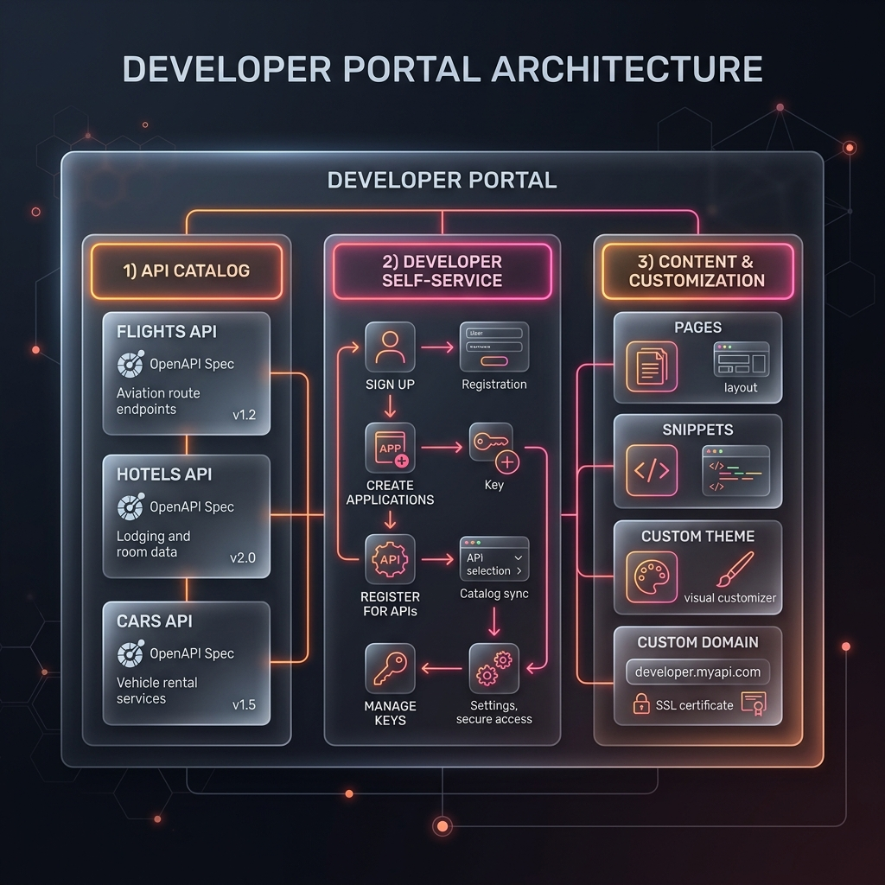
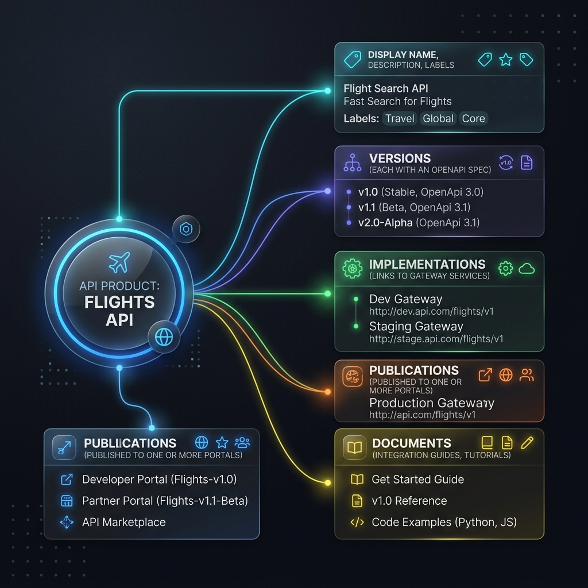
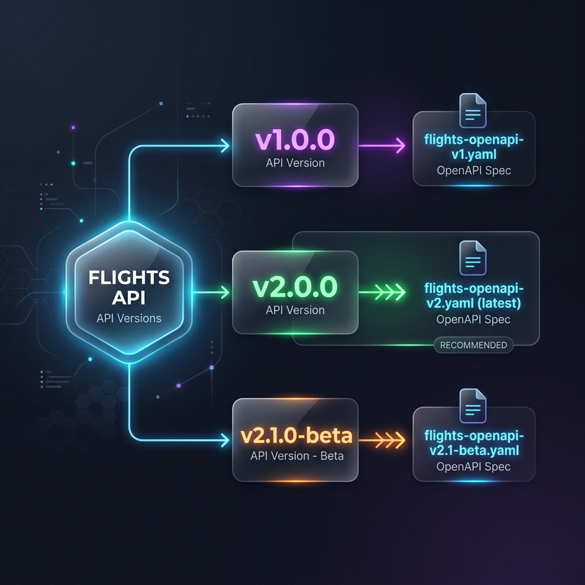
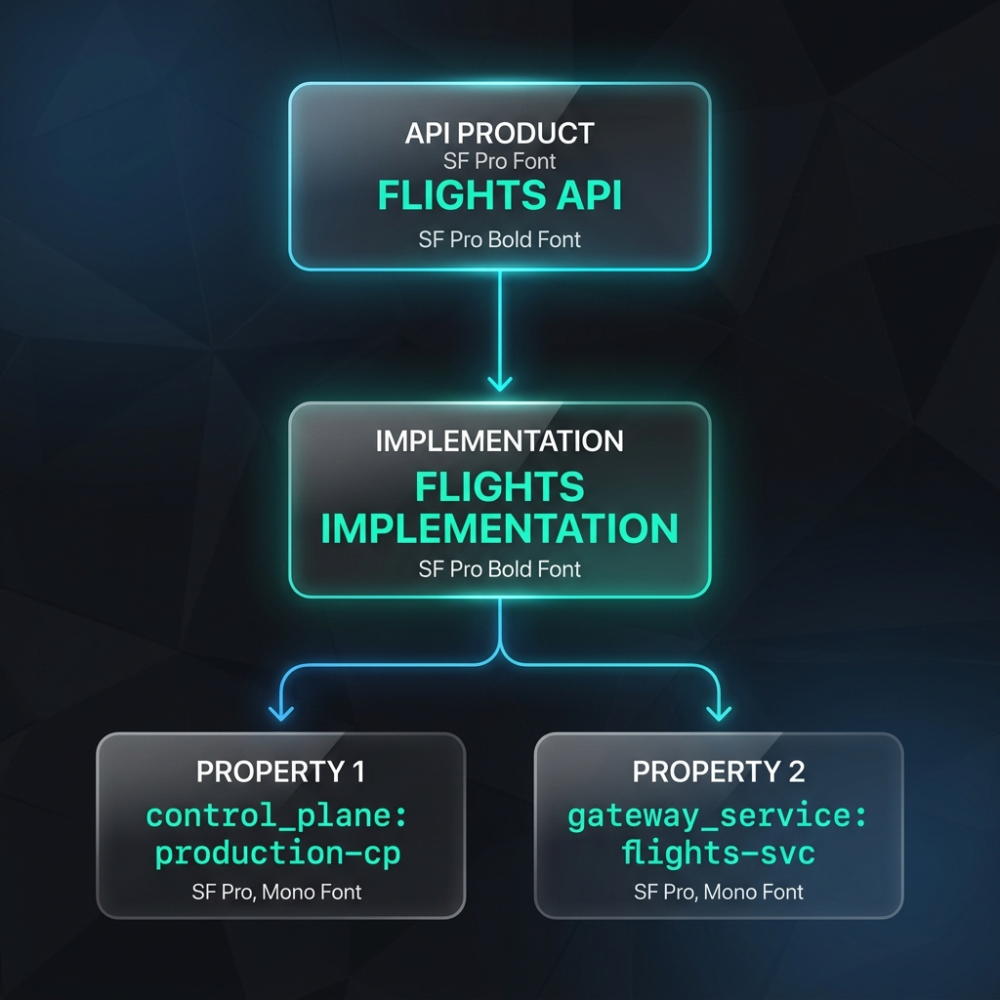
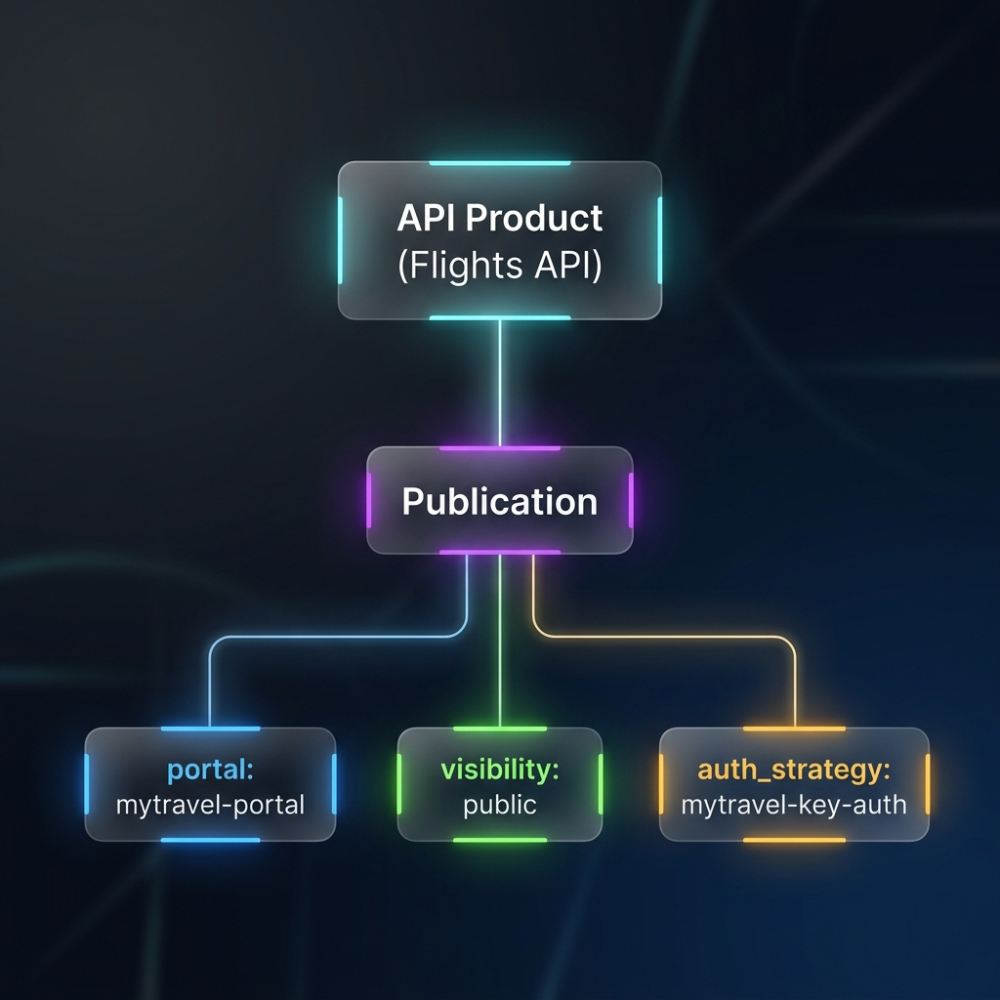
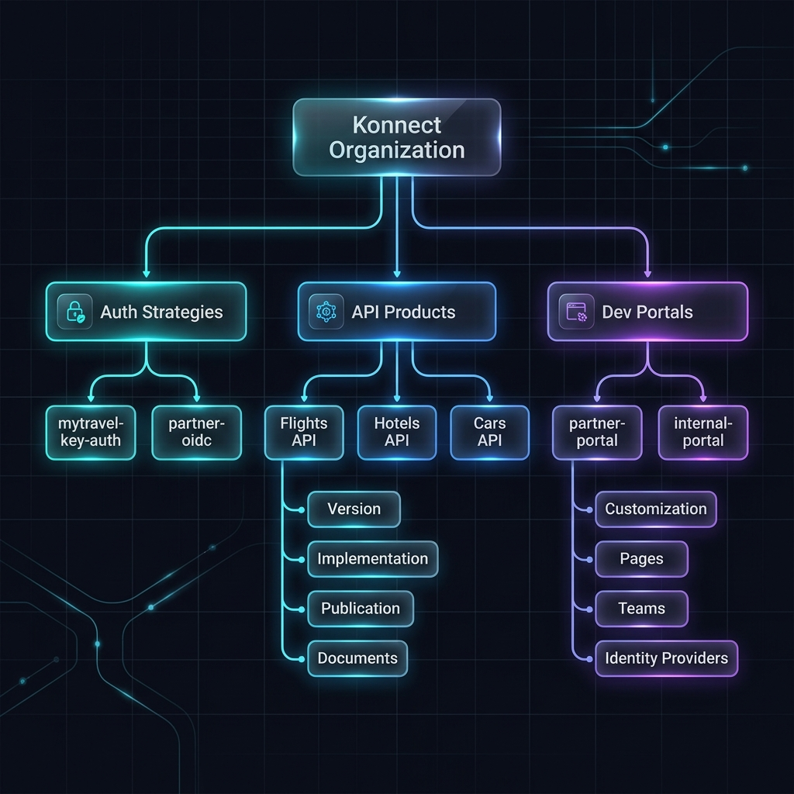
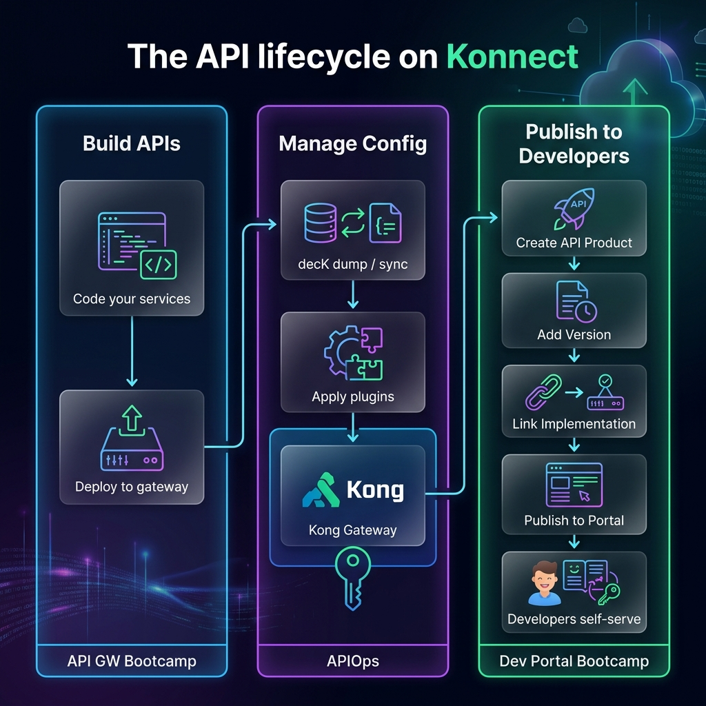
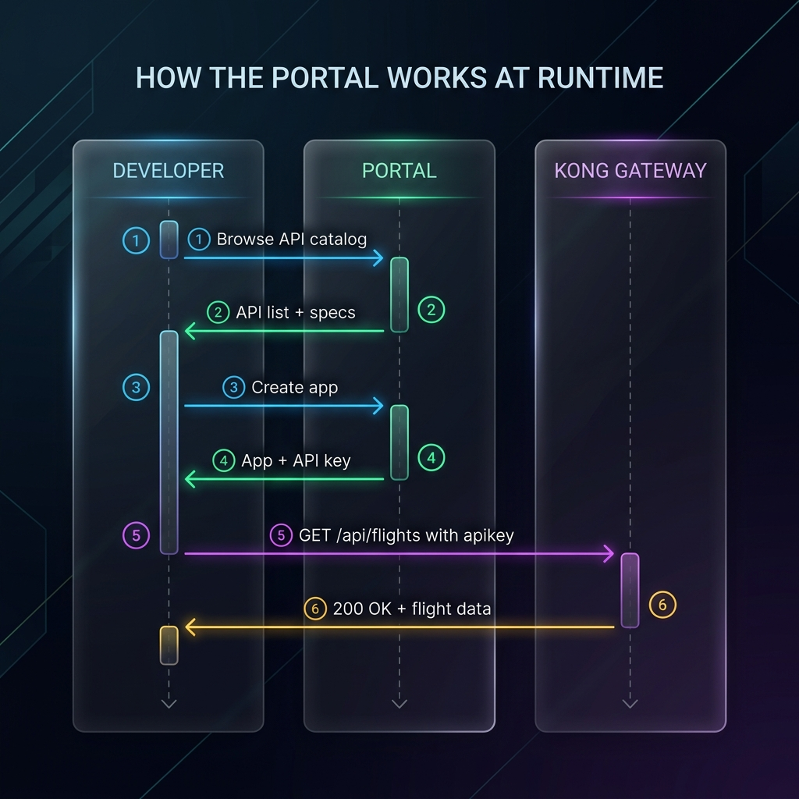

# What is Developer Portal?

> Read this before starting the labs. It takes about 10 minutes and gives you the mental model you'll need throughout the bootcamp.

## The problem

You've built APIs, routed traffic through Kong Gateway, applied plugins, and managed configuration with decK. Your internal team can hit the Admin API, but what about **external developers**?

They need to:

- **Discover** what APIs you offer
- **Read** interactive documentation (not a PDF)
- **Register** for access and get credentials
- **Test** API calls directly from the docs
- **Manage** their own applications and keys

Without a portal, you're answering emails, manually creating API keys, and maintaining a wiki that's always out of date.

## What Konnect Dev Portal gives you

The **Konnect Developer Portal** is a fully managed, customizable website where developers can find, try, and subscribe to your APIs. It's built into the Konnect platform - no separate infrastructure to host or maintain.

## Three portal patterns

Konnect supports three deployment patterns depending on your audience:

| Pattern | Visibility | Auth | Use case |
|---|---|---|---|
| **Internal Portal** | Private | IdP (SSO) required | Internal teams discover and consume internal APIs. Standards documentation, onboarding guides. |
| **Partner Portal** | Private | Self-registration with approval | Trusted external partners get vetted access. RBAC controls who sees which APIs. |
| **Public Portal** | Public | Optional | Open developer ecosystem. Anyone can browse docs, sign up, and get API keys. |

You can run **multiple portals** from the same Konnect organization - for example, one for internal developers and one for external partners, each showing different APIs.

## Key objects you'll work with

Dev Portal has a specific object model. Understanding it now saves confusion later.

### API Product

An **API Product** is the catalog entry that represents an API in Konnect. It's not the gateway service itself - it's the business-facing wrapper:

### Version

A **Version** is a specific release of an API product. Each version holds an **OpenAPI specification** that generates the interactive documentation on the portal.

Developers browsing the portal can switch between versions and see the docs for each.

### Implementation

An **Implementation** links an API product to a running **gateway service** on a control plane. This is what makes the "Try It" button work - without an implementation, the spec is just documentation with no live endpoint.

### Publication

A **Publication** publishes an API product to a specific portal. It controls:

- **Visibility**: `public` (anyone can see) or `private` (team-restricted)
- **Auth strategy**: which credential type developers get when they register
- **Auto-approve**: whether registration requires admin approval

### Auth Strategy

An **Authentication Strategy** defines how developer applications prove their identity. Konnect supports:

| Strategy | How it works | Best for |
|---|---|---|
| **Key Auth** | Portal issues an API key; developer sends it in a header | Simple integrations, getting started quickly |
| **OIDC (self-managed)** | Developer brings a client ID from their own IdP | Enterprise integrations where developers manage their own IdP apps |
| **OIDC (DCR)** | Portal auto-creates IdP apps via Dynamic Client Registration | Streamlined onboarding with automated credential management |

Auth strategies are **reusable** - the same strategy can protect multiple APIs on multiple portals.

### Putting it all together

## The API lifecycle on Konnect

Where Dev Portal fits in the broader picture:

You've already done the left and middle columns in previous bootcamps. Now you'll complete the right column.

## How the portal works at runtime

When a developer uses your portal:

1. **Browse** - Developer visits `yourportal.kongportals.com`, sees the API catalog
2. **Read** - Clicks an API, views the interactive OpenAPI spec (with "Try It")
3. **Register** - Creates an account (basic auth, OIDC, or SAML)
4. **Create app** - Creates an application in their developer account
5. **Subscribe** - Registers their app for an API, receives credentials (API key or OAuth)
6. **Call** - Makes authenticated requests through Kong Gateway

The gateway validates the API key using the same `key-auth` plugin you configured in the API Gateway bootcamp - but now the consumer and credentials are managed through the portal instead of manually.

## Portal vs Admin API

| | Dev Portal | Admin API / decK |
|---|---|---|
| **Audience** | External developers | Internal platform team |
| **Purpose** | Discover, subscribe, get credentials | Configure services, routes, plugins |
| **Access** | Portal URL (public or private) | Konnect UI / REST API / decK CLI |
| **Creates** | Applications, registrations | Services, routes, plugins, consumers |

The portal **complements** the Admin API - it doesn't replace it. Your platform team uses the Admin API (or decK) to configure the gateway; external developers use the portal to consume APIs.

## What you'll build in the labs

| Lab | What you'll do | Time |
|---|---|---|
| **01: Portal Setup** | Create a portal, publish 3 API products with OpenAPI specs | ~70 min |
| **02: App Registration** | Configure key-auth, walk through the full developer experience | ~60 min |
| **03: Customization** | Theme the portal, add pages, set up teams and SSO | ~65 min |

---

*Ready? Continue to [Teams and Roles →](./02-teams-and-roles) or jump straight to [Lab 01 →](./labs/01-portal-setup)*
