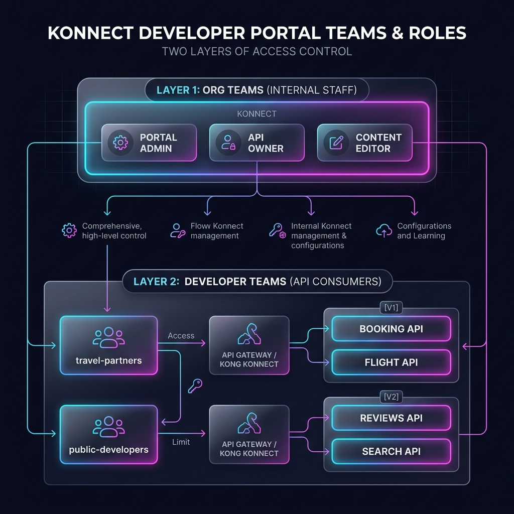
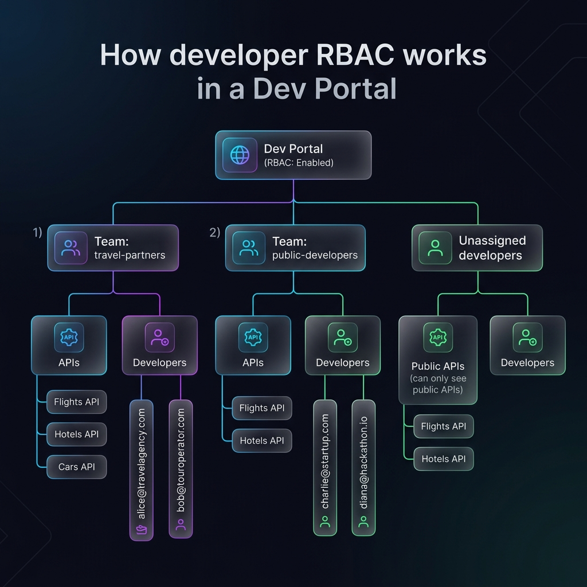
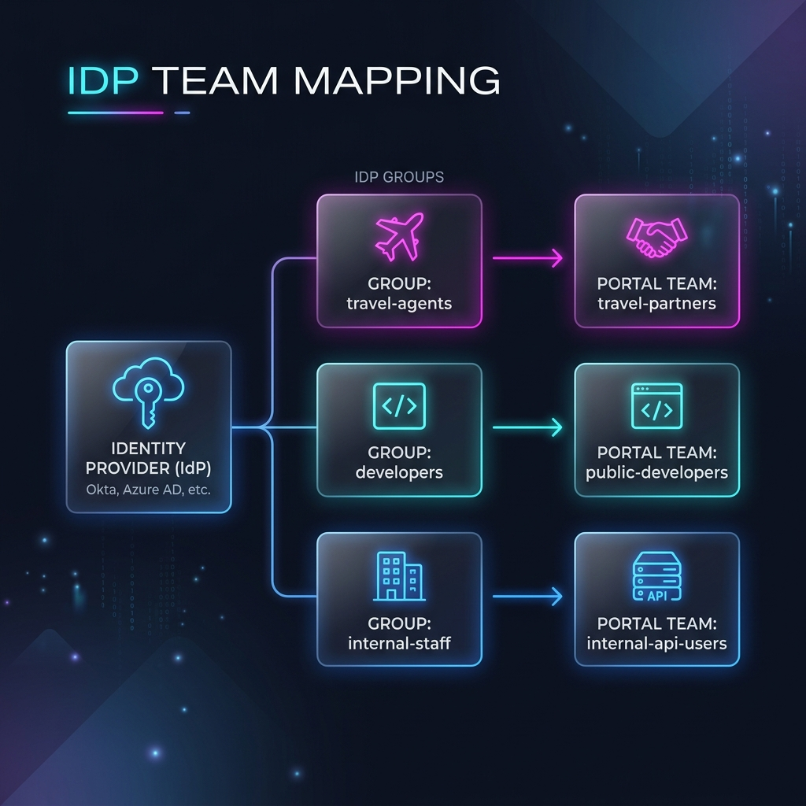
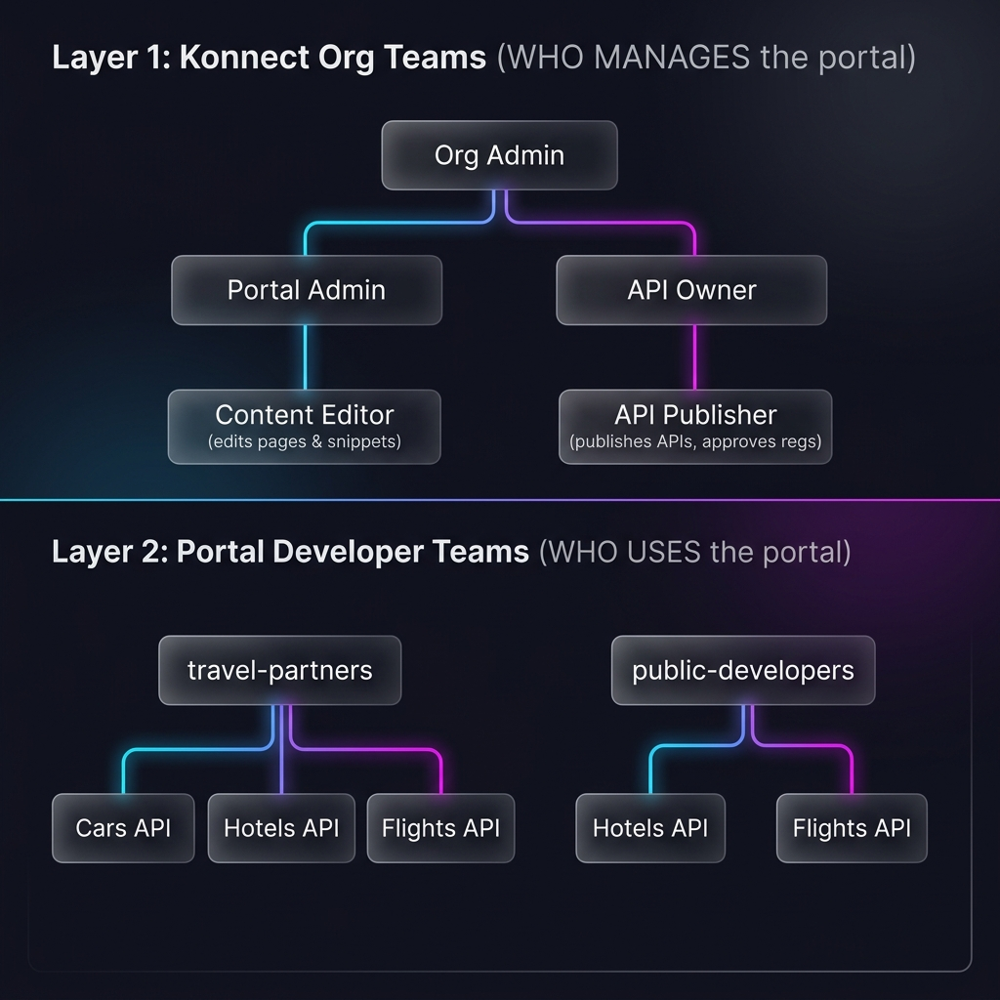

# Dev Portal Teams and Roles

> Read this before starting Lab 03. It takes about 10 minutes and explains the two layers of access control you'll configure.

## Two layers of access control

Konnect has **two separate** team systems for Dev Portal. Confusing them is the #1 mistake new users make:

| | Layer 1: Konnect Org Teams | Layer 2: Portal Developer Teams |
|---|---|---|
| **Who** | Your internal staff (platform engineers, API owners, content editors) | External developers (your API consumers) |
| **Controls** | Who can **manage** the portal, publish APIs, approve registrations | Who can **see and register** for specific APIs |
| **Where** | Konnect UI → Organization → Teams | Konnect UI → Dev Portal → Access and Approvals → Teams |
| **Created by** | Konnect org admin | Portal admin |

---

## Layer 1 - Konnect Organization Teams

These control which members of **your internal team** can do what in the Konnect platform.

### Predefined teams

Every Konnect organization comes with these default teams (cannot be modified or deleted):

| Team | What members can do |
|---|---|
| **Organization Admin** | Full access to all Konnect resources, including Dev Portal |
| **Portal Admin** | Full management of Dev Portal content, configuration, developer and application approvals, and service connections |
| **API Product Admin** | Create and manage API products, publish versions to Dev Portal, enable application registration |
| **API Product Developer** | Create and manage versions of API products |

### Dev Portal roles (for custom teams)

You can create **custom teams** and assign specific roles. Here are the Dev Portal-specific roles:

| Role | What it grants |
|---|---|
| **Admin** | Full access - manage developers, applications, teams, publish APIs, grant access, delete the portal |
| **Creator** | Create new Dev Portals |
| **Maintainer** | Edit/delete applications, view developers, publish APIs, grant access (cannot delete the portal) |
| **Viewer** | Read-only access to developers and applications |
| **Content Editor** | Edit portal pages, snippets, and customization |
| **Product Publisher** | Publish API products to the portal |
| **API Registration Approver** | Approve developer application registration requests |

### Related roles (other Konnect resources)

Some portal workflows also need roles on other resource types:

| Resource | Role | Why you need it |
|---|---|---|
| **Catalog APIs** | Admin, Maintainer, Publisher | To create API products and publish them to portals |
| **Auth Strategies** | Creator, Maintainer | To create and manage key-auth or OIDC strategies |
| **DCR Providers** | Creator, Maintainer | To set up Dynamic Client Registration with external IdPs |
| **Control Planes** | Viewer (minimum) | To link API products to gateway services via implementations |

### Recommended custom teams

Kong recommends these custom team configurations for typical organizations:

#### API Platform Owner

Full access to create, configure, and delete resources related to APIs, portals, and applications.

| Roles |
|---|
| Portal Creator |
| Portal Admin |
| API Creator |
| API Admin |
| API Publisher |
| Auth Strategy Creator |
| Auth Strategy Maintainer |

#### Portal Owner

Full access to configure a specific portal and manage applications.

| Roles |
|---|
| Portal Admin (scoped to a specific portal) |
| Auth Strategy Viewer |
| API Viewer (for APIs they can approve) |
| API Publisher (for specific APIs) |

#### API Owner

Define, configure, publish, and approve registrations for specific APIs.

| Roles |
|---|
| API Admin (scoped to specific APIs) |
| API Publisher (scoped to specific APIs) |
| API Registration Approver (scoped to specific APIs) |
| Auth Strategy Viewer |
| Portal Viewer |

#### API Security Owner

Manage authentication strategies and DCR providers.

| Roles |
|---|
| Auth Strategy Creator |
| Auth Strategy Maintainer |
| DCR Provider Creator |
| DCR Provider Maintainer |

#### Portal Content Editor

Write and manage portal pages, snippets, and appearance.

| Roles |
|---|
| Portal Content Editor (scoped to a specific portal) |

::: tip Role scoping
Most roles can be scoped to a **specific resource**. For example:
- Portal Admin for only the staging portal
- API Owner for only the Flights API
- Auth Strategy Viewer for only the key-auth strategy

This enables **least-privilege access** - each team member gets exactly the permissions they need, nothing more.
:::

---

## Layer 2 - Portal Developer Teams

These control which **external developers** (your API consumers) can see and register for specific APIs. This is the RBAC system within the portal itself.

### Developer roles

| Role | What it grants |
|---|---|
| **API Consumer** | Developer can make API calls to the selected APIs (register for access, get credentials) |
| **API Viewer** | Read-only access to the API documentation (can see the spec, but cannot register) |

### How developer RBAC works

1. **Enable RBAC** on the portal (Settings → Security → Role-based access control)
2. **Create developer teams** (e.g., `travel-partners`, `public-developers`)
3. **Assign API roles** to each team (which APIs they can access, Consumer vs Viewer)
4. **Add developers** to teams - manually, or automatically via IdP group mapping

### Visibility + RBAC interaction

| API Visibility | RBAC Enabled? | Who can see it |
|---|---|---|
| **Public** | No | Everyone (even unauthenticated visitors) |
| **Public** | Yes | Everyone can see, but only team members with Consumer role can register |
| **Private** | No | All authenticated developers |
| **Private** | Yes | Only developers in a team with Consumer or Viewer role on that API |

### Application ownership

Teams can also **own applications**. When team app ownership is enabled:

- Developers can assign new applications to their team during creation
- Team members share access to the team's applications and credentials
- Ownership can be transferred between developers and teams

This is useful when a partner organization has multiple developers who all need access to the same API keys.

---

## IdP team mapping

If your portal uses SSO (OIDC or SAML), you can **automatically map** IdP groups to portal developer teams:

When a developer signs in via SSO, Konnect reads their group claims and automatically adds them to the corresponding portal teams. No manual assignment needed.

Configure this in **Dev Portal → Settings → Team Mappings**.

---

## When to use which

| Scenario | Layer | What to configure |
|---|---|---|
| "Alice should be able to publish APIs to the portal" | Layer 1 (Org) | Add Alice to a Konnect team with API Publisher role |
| "Bob (external dev) should see the private Cars API" | Layer 2 (Portal) | Add Bob to a portal developer team with Consumer role on Cars API |
| "Only the security team can manage auth strategies" | Layer 1 (Org) | Create a custom team with Auth Strategy Maintainer role |
| "Partners see private APIs, public devs don't" | Layer 2 (Portal) | Set API visibility to private, create partner team with access |
| "New partner devs should auto-join the right team" | Layer 2 (Portal) | Configure IdP team mapping with SSO groups |
| "The content team should only edit pages, not config" | Layer 1 (Org) | Create a team with only Content Editor role |

---

## Summary

---

*Next: Start [Lab 01 - Portal Setup & API Publishing →](./labs/01-portal-setup)*
